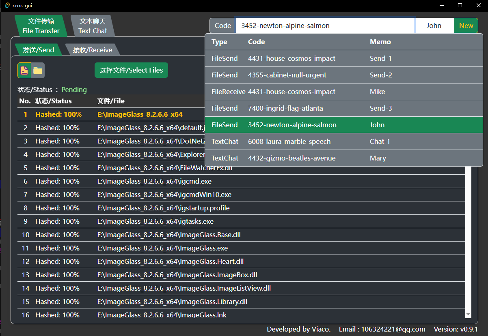
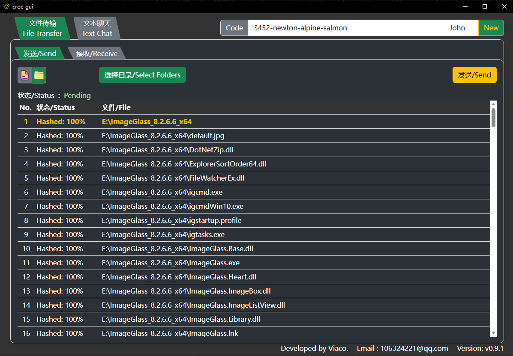
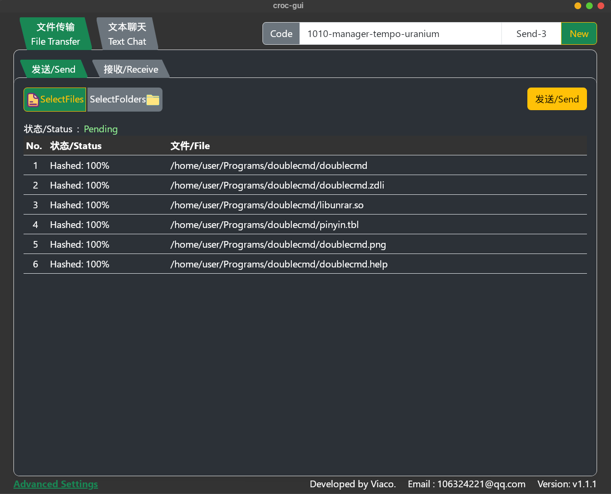
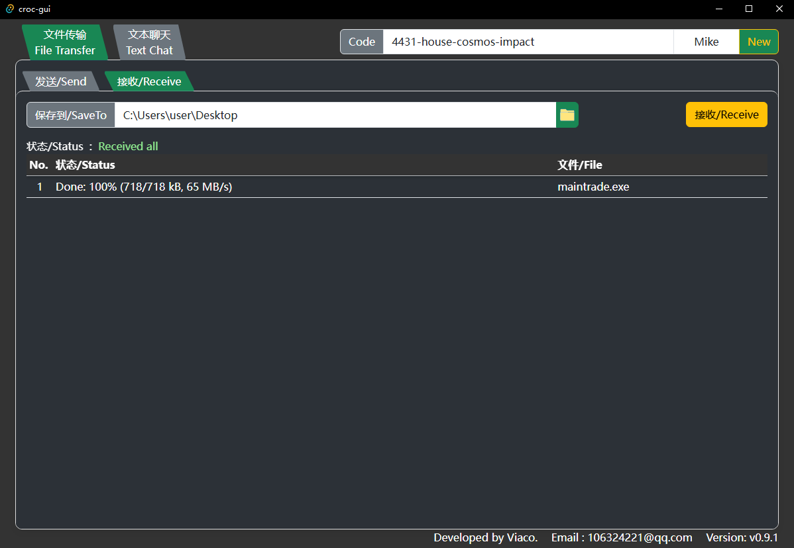

# Croc-GUI

> Project Begin Time：2025-10-04

## Overview

Croc-gui base on [schollz/croc](https://github.com/schollz/croc). Easily and securely send things from one computer to another. No file size limit. For windows, Linux, MacOS. Developed using Tauri+Rust+Vue.

### Features of Croc  
- Allows any two computers to transfer data (using a relay)
- Provides end-to-end encryption (using PAKE)
- Enables easy cross-platform transfers (Windows, Linux, Mac)
- Allows multiple file transfers
- Allows resuming transfers that are interrupted
- No need for local server or port-forwarding
- IPv6-first with IPv4 fallback
- Can use a proxy, like Tor

### Features of Croc-gui
Croc-gui is just a GUI,the base is Croc. Croc-gui has all advantages of Croc,and it has advantages as following.Based on Croc's text transfer feature, croc-gui adds the feature of chat.  
- Multi transfer task management
- Multi-chat and listen the back message automatically
- New message notify when multi-chatting

1. Multi transfer tasks

2. Send folder

3. Send file

4. Receive file

5. Text chat

**Notice:**  

Certain antivirus programs (e.g., 360 Antivirus) may trigger a false positive alert, as croc-gui invokes the external tool croc.
This detection is a false alarm, and the application is safe and clean.

## Compile

After install rust and npm,run the commands below：  
cd croc-gui  
npm install -g @tauri-apps/cli
npm install  
npm run tauri build

## Install

Install [croc](https://github.com/schollz/croc) first . For Windows, download the zip file here then unzip it. The zip file contains [croc](https://github.com/schollz/croc) and croc-gui. 
